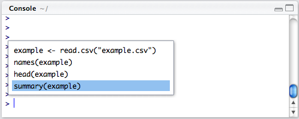
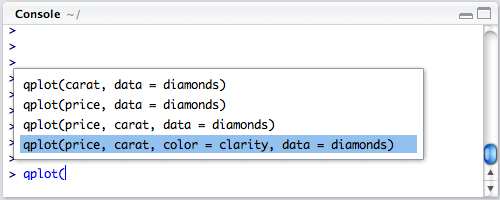

```{r setup, include=FALSE}
knitr::opts_chunk$set(echo = TRUE)
```

## Introducción

La consola de RStudio incluye una variedad de características que nos permitirán trabajar de forma sencilla y eficiente. Esta tarea analiza estas características.

Aprender el uso de estas funciones puede jugar un papel fundamental en la
productividad con R.


### Recuperando Comandos


As you work with R you'll often want to re-execute a command which you previously entered. As with the standard R console, the RStudio console supports the ability to recall previous commands using the arrow keys:

En el trabajo diario con R amenudo nos encontraremos la necesidad de ejecutar de nuevo un comando utilizado con anterioridad. La consola de RStudio proporciona 
la funcionalidad de recuperar comandos con las teclas de "flecha":  


- __Up__: Recupera el último comando introducido.

- __Down__: Retrocede un comando(s) de Up.  


Por otro lado, si deseamos recuperar una lista con los comandos recientes podemos utilizar las
teclas __Ctrl+Up__ :





Además, podemos utilizar el mismo atajo de teclado para buscar comandos que coinciden con un prefijo. Por ejemplo, si deseamos recuperar instancias anteriores de la función `plot` simplemente escribiremos `plot` y a continuación __Ctrl+Up__:

  


En esta ocasión hemos realizado el ejercicio por ti:


__Ejercicio 1:__

Crea un vector de tipo númerico con los valores 3, 12, 13, 4, 6:

```{r eval=FALSE}
# Creación del vector
vector <- c(3, 12, 13, 4, 6)
```

__Ejercicio: 2__


Calcula la suma de los valores del vector con la función `sum()`:
```{r eval=FALSE}
sum(vector)
```


__Ejercicio: 3__  

Calcula la media del vector con la función `mean()`:
```{r eval=FALSE}
mean(vector)
```


__Pregunta:__  

Utiliza lo que has aprendido en el video y en la introducción de la tarea para recuperar el comando del historial que calcula la media del vector.
¿Cuál es la media del vector?

__Posibles respuestas:__  

- 5.4
- 7.6
- 10.45
- 12.23


__Recuerda que:__ desde la consola, puedes utiliza la "flecha arriba" de tu teclado para navegar por el historial de comandos.


