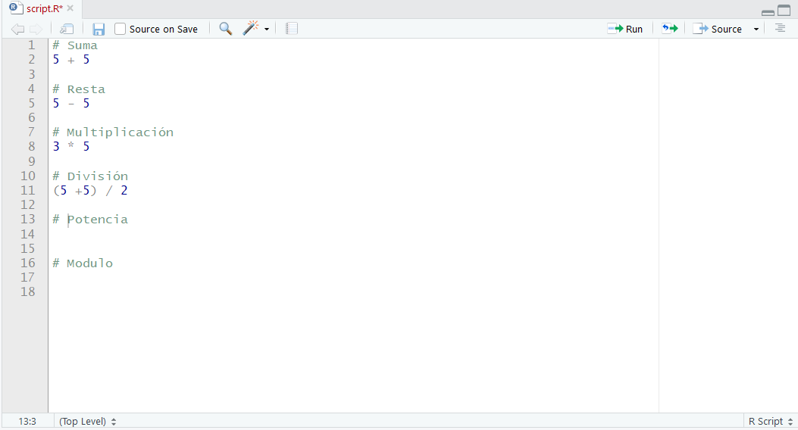

## Introducción

Podemos utilizar R como calculadora. Analiza los siguientes operadores:

- Suma: `+`
- Resta: `-`
- Multiplicación: `*`
- División: `/`
- Exponennte: `^`
- Modulo: `%%`

Los dos últimos operadores podrían necesitar algo de explicación:

- El operador `^` eleva el número de su izquierda a la potencia del número en su
derecha, por ejemplo `3 ^ 2` es 9.
- El operador modulo devuelve el resto de la división del número de la izquierda
por el número de la derecha, por ejemplo `5 %% 3` es 2.

Con los conocimientos adquiridos, sigue las instrucciones que encontrarás a 
continuación para completar el ejercicio en el archivo __script.R__ que encontrarás
abierto en el editor:

  

Instructions:
**Instrucciones:**  

- Escribe  `2 ^ 5` para calcular la potencia de dos elevado a cinco.

Instructions:
**Instrucciones:**  

- Escribe `28 %% 6` para calcular el resto de la división:

Instructions:
**Instrucciones:**  

- Selecciona el código del script mediante __CRTL + A__ y ejecutálo en la cónsola
con la combinación de las teclas __CTRL + ENTER__

Question:
**Pregunta 1:**  

¿Que resultado se muestra en la consola para `2 ^ 5`?

Question:
**Pregunta 2:**  

¿Que resultado se muestra en la consola para `28 %% 6`?

